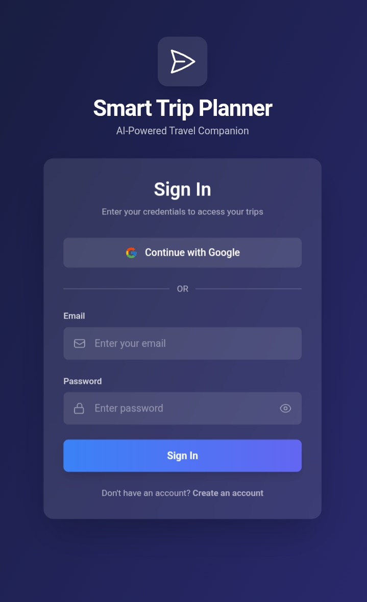
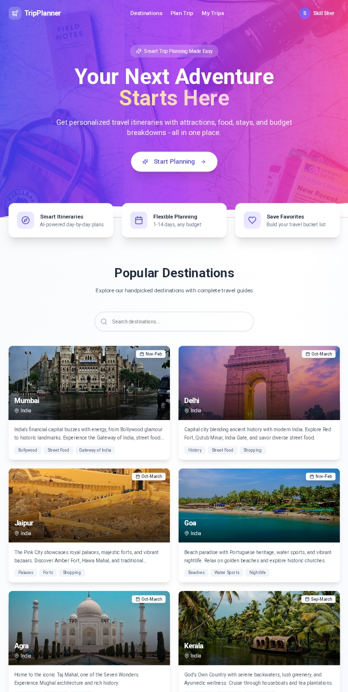
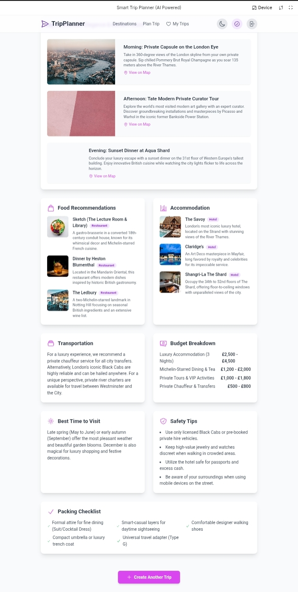

# Smart Trip Planner (AI Powered) 🌍

Smart Trip Planner is a full-stack AI-powered web application that generates
personalized travel itineraries using Google Gemini AI.

This project was built as an **internship-ready project** to demonstrate
full-stack development, backend logic, and AI integration.

---

## 🚀 Features
- AI-generated trip plans
- User authentication (Login & Register)
- Trip planning, saving, and sharing
- Admin dashboard for managing trips, users, and destinations
- Download trip plans
- Clean and modular project structure

---

## 🛠 Tech Stack

### Frontend
- HTML
- CSS
- JavaScript
- React (TypeScript)

### Backend
- PHP
- Google Gemini AI API

---

## 🔐 Security Note
API keys and sensitive credentials are **not included** in this public
repository for security reasons.

---

## 🌐 Why no live demo?
This project requires:
- PHP backend server
- React + TypeScript build tools
- AI API integration

GitHub Pages does not support this environment.
Therefore, the **complete source code is provided instead**, which is
acceptable for internship evaluation.

---

## 📸 Screenshots

### 🔐 Login Page

### 🏠 Home / Destinations

### 🧭 Plan Trip

### 📊 Trip Result

### 🗺️ Map View

### 🛠️ Admin Dashboard

---

## ▶️ How to Run Locally
1. Install **XAMPP / WAMP**
2. Place the project folder inside `htdocs`
3. Add your Gemini API key in `gemini.php`
4. Start Apache server
5. Open `http://localhost/smart-trip-planner-ai`

---

## 👨‍💻 Author
**Soham**  
Computer Engineering Student  
India
